<!--Header -->  

  

<!-- Seção de introdução -->

----

<i><b>Olá</b> 👋, me chamo <code>João Gabriel</code>, tenho 20 anos e sou estudante de <code>Engenharia de Software</code> na <a href="https://www.pucminas.br" target="_blank">PUC Minas</a>.  
Estudo programação desde 2023 com foco em<code>Fullstack</code>.</i>

  

<!-- Seção de minhas redes -->
<h3>🔔 Minhas Redes:</h3>

<table>
<tr>
<td>
</td>
<td>
</td>
<td>
</td>
<td>
</td>
</tr> 
</table>

----

<!-- Seção sobre mim -->

<h3>🙋‍♂️ Sobre mim:</h3>

 Olá! Meu nome é João Gabriel e sou estudante de Engenharia de Software na PUC Minas, campus Coração Eucarístico. Desde que iniciei minha jornada na programação, em 2023, tenho me dedicado intensamente a aprender e aplicar os conhecimentos em desenvolvimento de software, tanto no ambiente acadêmico quanto em projetos pessoais.
Meu foco está em construir soluções eficientes e bem estruturadas, explorando tanto o front-end quanto o back-end, com especial interesse por arquitetura de software e banco de dados. Atualmente, minha stack principal inclui Java, Spring Boot, PostgreSQL, APIs RESTful, JavaScript e React.js. Utilizo ferramentas como VS Code, PGAdmin e Live Server para o desenvolvimento e integração dos meus projetos.

No 4º período da faculdade, tive contato direto com padrões de projeto e arquitetura de sistemas, o que fortaleceu meu desejo de atuar como arquiteto de software no futuro. Paralelamente aos estudos formais, invisto na minha formação prática por meio de cursos na Alura e na Udemy, onde aprofundo temas como SQL, desenvolvimento web e boas práticas de código.

Fui reconhecido com o prêmio de destaque acadêmico pelo melhor trabalho interdisciplinar do segundo semestre de 2024, onde meu grupo desenvolveu um ERP para uma empresa de autopeças. Atuei no front-end, parte do back-end e na modelagem do banco de dados, aplicando conceitos reais de engenharia de software em um projeto completo e funcional.

Atualmente, desenvolvo um sistema de gestão para restaurantes utilizando Spring Boot e PostgreSQL, com funcionalidades como autenticação, controle de pedidos, reservas de mesa e avaliações. O projeto foi estruturado para que cada funcionalidade opere de forma independente, reforçando o princípio de modularidade e responsabilidade única.

Busco constantemente aprimorar minhas habilidades técnicas e teóricas, mantendo resumos organizados dos conteúdos estudados e praticando lógica de programação diariamente com exercícios no Beecrowd. Também estou desenvolvendo o hábito da leitura técnica, com foco atual no livro Engenharia de Software Moderna, de Marco Túlio Valente.

----

<h3> 🎯 Meus interesses:</h3>

<table>
  <tr>
    <td>
      

        Sou mineiro e tenho 20 anos. Fora do mundo da tecnologia, gosto de aproveitar meu tempo com atividades que me desafiem e tragam emoção, como trilhas, kart e academia. Também sou fã de carros e apaixonado por videogames, especialmente jogos de corrida e mundo aberto, como F1, Forza Horizon, CarX Drift e GTA V. Nos momentos de descanso, gosto de ouvir música e acompanhar o meu time do coração, o Atlético Mineiro.
      

    </td>
    <td>
      

        
      

    </td>
  </tr>
</table>

----

<!-- Seção de Ligugens e Ferramentas-->

<h3> 💻 Linguagens:</h3>

<code></a></code>
&nbsp; 
<code></a></code>
&nbsp; 
<code></a></code>
&nbsp; 
<code></a></code>
&nbsp; 
<code></a></code>
&nbsp; 
<code></a></code>
&nbsp; 
<code></a></code>
&nbsp;
<code></a></code>
&nbsp;
<code></a></code>
&nbsp;
<code></a></code>
&nbsp;
<code></a></code>
&nbsp;
<code></a></code>
&nbsp;
<code></a></code>
&nbsp;
<code></code>
&nbsp;
<code></code>
&nbsp;

-----

<h3>🔨 Ferramentas: </h3>

<code></a></code>
&nbsp; 
<code></a></code>
&nbsp; 
<code></a></code>
&nbsp; 
<code></a></code>
&nbsp; 
<code></a></code>
&nbsp; 
<code></a></code>
&nbsp; 
<code></a></code>
&nbsp; 
<code></a></code>
&nbsp;
<code></a></code>
&nbsp;
<code></code>
&nbsp;
<code></a></code>
&nbsp; 
<code></a></code>
&nbsp; 
<code></a></code>
&nbsp; 
<code></a></code>
&nbsp; 
<code></a></code>
&nbsp; 

----

<!-- Seção de Projetos -->

<h3>📲 Alguns dos meus Projetos:</h3>

<table>
<tr>
<td align="center">

</td>
<td align="center">

</td>
<td align="center">

</td>
</tr>

<tr>
<td align="center">🎥 <a href="" target="_blank">Tô de Carro</a></td>
<td align="center">🎥 <a href="" target="_blank">ERP Vortex</a></td>
<td align="center">🎥 <a href="" target="_blank">Restaurante Apetito</a></td>
</tr>

<tr>
<td align="center" width="30%">
Sistema de aluguel de veículos com cadastro de clientes, gestão de pedidos e contratos.  
🛠️ Java • Spring Boot • PostgreSQL • HTML/CSS/JS
</td>
<td align="center" width="30%">
ERP desenvolvido para uma empresa de autopeças, com controle de estoque, vendas e clientes.  
🛠️ JavaScript • Node.js • MySQL • HTML/CSS
</td>
<td align="center" width="30%">
Sistema de gestão para restaurantes com pedidos, reservas e avaliações.  
🛠️ Java • Spring Boot • PostgreSQL • React.js
</td>
</tr>
</table>

----
<!-- Seção de Certificados -->

<h3>&nbsp; Minhas Formações e Certificações:</h3>

<table>
<tr>
<td align="center" width="200" height="40px">
<a href="https://www.pucminas.br/" target="_blank">
 
<strong>PUC Minas</strong>
</a>  
Graduação em Engenharia de Software com participação ativa em workshops, palestras e projetos interdisciplinares.
</td>

<td align="center" width="200" height="40px">
<a href="https://www.udemy.com/" target="_blank">
 
<strong>Udemy</strong>
</a>  
Cursos focados em Java e Python, com ênfase em desenvolvimento backend e fundamentos da programação.
</td>

<td align="center" width="200" height="40px">
<a href="https://www.alura.com.br/" target="_blank">
 
<strong>Alura</strong>
</a>  
Formação em desenvolvimento web com foco em React, Node.js e PostgreSQL, além de fundamentos de SQL e lógica.
</td>
</tr>
</table>

----

<!-- Seção de Atividade no GitHub -->

<h3>📈 Atividade no GitHub:</h3>
<section align="center">

<table>
<tr>
<td>

</td>
<td>

</td>
<td>

</td>
</tr>
</table>

 

<!-- Segunda linha: GitHub Wrapped e WakaTime -->

<table>
<tr>
<!--<td>:octocat: <a href="https://www.githubwrapped.io/Joaogabrielmaia" target="_blank">GitHub Wrapped</a></td>
<td>:watch: <a href="https://wakatime.com/@jgmcosta">WakaTime</a></td>-->
</tr>
<tr>
<td>

</td>
<td>

</td>
</tr>
</table>

 

<!-- Terceira linha: Cartões do perfil -->

<table>
<tr>
<td>

</td>
<td>

</td>
<td>

</td>
</tr>
<tr>
<td>

</td>
<td>

</td>
<td>

</td>
</tr>
</table>

 

<!-- Visitas e seguidores -->

<table>
<tr>
<td>

</td>
<td>

</td>     
<td>

</td>
<td>

</td>
</tr>
</table>

 

<!-- Stats -->

<table>
     
<tr>
<td>

</td>
<td>

</td>
</tr>
<tr>
<td>

</td>
<td>

</td>
</tr>
<tr>
</tr>
</table>

</section>

----

<!-- Seção de Leituras Atuais -->

<h3>📖 Leituras atuais: </h3>
  

<table>
<tr>
<td align="center" width="220">
  
<strong>Engenharia de Software Moderna</strong> 
<em>Marco Túlio Valente</em>
</td>
<td align="center" width="220">
  
<strong>O Programador Pragmático</strong> 
<em>Andrew Hunt & David Thomas</em>
</td>
</tr>
</table>

📚 Todas as leituras acima possuem resenhas escritas por mim disponíveis no repositório acima.

----

<!-- Seção Spotify -->

<h3>

Minhas músicas
</h3>

<table>
<tr>
<td>

</td>
<td>

</td>
</tr>
</table>

----

<!-- Seção de Outras redes -->

<h3> 📞 Entre em contato comigo!</h3>
</table>

 

 

----

<!-- Seção Footer -->

<table>
<td>

</td>
</tr>
</table>

