### Kayque Allan - Software Engineering Student and Technology Enthusiast

<!--- Olá, esse é meu readme, fique à vontade para utilizá-lo como quiser! --> 

<div>

</div>

-----

<div align="center">
<table>
<tr>
 <td align="center" colspan="11"></td>
</tr> 
<tr>
<td><a href="https://github.com/kayqueallan" target="_blank"></a>
</td>
<td><a href="mailto:kayqueallan@gmail.com" target="_blank"></a>
</td>
<td><a href="https://wa.me/5531980402103" target="_blank"></a>
</td>
<td><a href="https://www.instagram.com/kayqueallan/" target="_blank"></a>
</td>
<td><a href="https://www.linkedin.com/in/kayqueallan/" target="_blank"></a>
<td><a href="https://discordapp.com/users/959151773728251914" target="_blank"></a>

</tr>
<tr>
 <td align="center" colspan="11"></td>
</tr> 
</table>

</div>
<div align="justify">
<i><b>Olá</b> :wave:, sou o <code>Kayque Allan</code>, tenho 20 anos, moro em Contagem-MG e sou programador desde os 17 anos de idade. Atualmente sou <code>Estudante</code> do curso de Engenharia de Software <a href="https://www.pucminas.br/" target="_blank">PUC Minas</a>.</i> :man_teacher:
</div>

-----

Sobre mim:

<div align="justify">
Doutor (2017-2020) e mestre (2014-2015) em <a href="https://www.fumec.br/pos-graduacao-em-tecnologia-da-informacao-e-comunicacao-e-gestao-do-conhecimento" target="_blank">Sistemas de Informação e Gestão do Conhecimento</a> pela <a href="http://www.fumec.br/" target="_blank">Universidade FUMEC</a>, onde também obteve graduação em <a href="https://processoseletivo.fumec.br/curso/ciencia-da-computacao/" target="_blank">Ciência da Computação</a> (2010-2013). Profissional com 13 anos de experiência no mercado de desenvolvimento de sistemas e há 9 anos na área de educação com ensino de tecnologia. Atualmente, é professor das disciplinas de <a href="https://github.com/kayqueallan/fundamentos-de-projeto-e-analise-de-algoritmos" target="_blank">Fundamentos de Projeto e Análise de Algoritmos</a>, <a href="https://github.com/kayqueallan/projeto-de-software" target="_blank">Projeto de Software</a>, <a href="https://github.com/kayqueallan/laboratorio-de-desenvolvimento-de-software" target="_blank">Laboratório de Desenvolvimento de Software</a>, <a href="https://github.com/kayqueallan/laboratorio-de-experimentacao-de-software" target="_blank">Laboratório de Experimentação de Software</a> e <a href="https://github.com/kayqueallan/trabalho-interdisciplinar-aplicacoes-para-cenarios-reais" target="_blank">Trabalho Interdisciplinar: Aplicações para Cenários Reais</a> do curso de <a href="https://www.pucminas.br/campus/coracao-eucaristico/ensino/graduacao/Paginas/Engenharia-de-Software.aspx" target="_blank">Engenharia de Software</a> da <a href="https://www.pucminas.br/" target="_blank">PUC Minas</a>. Além disso, é orientador na disciplina de <a href="https://github.com/kayqueallan/trabalho-de-conclusao-de-curso-ii" target="_blank">Trabalho de Conclusão de Curso II</a> e é CTO da <a href="https://icei.pucminas.br/aes/" target="_blank">Agência Experimental de Software</a> do <a href="https://icei.pucminas.br/index.php/cursos/graduacao/engenharia-de-software/coracao-eucaristico/noticias-engenharia-software-praca-liberdade/1520-a-agencia-experimental-de-software-esta-recrutando" target="_blank">ICEI - Instituto de Ciências Exatas e Informática</a> da <a href="https://www.pucminas.br/" target="_blank">PUC Minas</a>, encarregado da gestão de 6 times de desenvolvimento, totalizando em média 30 pessoas na equipe. Também foi professor das disciplinas de <a href="https://github.com/kayqueallan/trabalho-interdisciplinar-aplicacoes-web" target="_blank">Trabalho Interdisciplinar: Aplicações Web</a> e <a href="https://github.com/kayqueallan/algoritmos-e-estruturas-de-dados-i" target="_blank">Algoritmos e Estruturas de Dados I</a> (Linguagem C) do curso de <a href="https://www.pucminas.br/campus/coracao-eucaristico/ensino/graduacao/Paginas/Engenharia-de-Software.aspx" target="_blank">Engenharia de Software</a> e da disciplina de <a href="https://github.com/kayqueallan/laboratorio-de-introducao-a-programacao" target="_blank">Laboratório de Iniciação à Programação</a> do curso de <a href="https://www.pucminas.br/unidade/coracao-eucaristico/ensino/graduacao/Paginas/Ciencia-da-Computacao.aspx" target="_blank">Ciência da Computação</a> da <a href="https://www.pucminas.br/" target="_blank">PUC Minas</a>. No mercado, presta consultoria para empresas de recrutamento e seleção em tecnologia, aplicando inteligência artificial na identificação e avaliação de perfis técnicos. Anteriormente, foi professor das disciplinas de <a href="https://github.com/kayqueallan/linguagens-de-programacao" target="_blank">Linguagens de Programação</a> (Java), <a href="https://github.com/kayqueallan/arquitetura-de-aplicacoes-web" target="_blank">Arquitetura de Aplicações Web</a> e <a href="https://github.com/kayqueallan/banco-de-dados" target="_blank">Banco de Dados</a> dos cursos de <a href="https://newtonpaiva.br/cursos/graduacao-presencial/ciencia-da-computacao/" target="_blank">Ciência da Computação</a>, <a href="https://newtonpaiva.br/cursos/graduacao-presencial/sistemas-de-informacao/" target="_blank">Sistemas de Informação</a> e <a href="https://newtonpaiva.br/cursos/graduacao-presencial/analise-e-desenvolvimento-de-sistemas/" target="_blank">Análise e Desenvolvimento de Sistemas</a> do <a href="https://newtonpaiva.br/" target="_blank">Centro Universitário Newton Paiva</a>. Atuou como Tech Manager na holding <a href="https://in8.com.br/" target="_blank">IN8</a>, responsável pela liderança de squads de desenvolvimento de múltiplos projetos para o mercado de milhas aéreas. Foi Tech Lead nos times de back-end e ciência da computação na <a href="https://www.betrybe.com/" target="_blank">Trybe</a> (2020-2023), responsável pela gestão de diversas equipes, além da pesquisa e tomada de decisão em hard skills, definição dos OKRs e KPIs da área, formação e desenvolvimento técnico do time, processos seletivos, produção de conteúdo (<a href="https://github.com/kayqueallan/python/tree/main/PROJETOS" target="_blank">Python</a> e <a href="https://github.com/kayqueallan/laboratorio-de-desenvolvimento-de-software/tree/main/PROJETOS" target="_blank">Java</a>) e revisão técnica. Foi professor de Arquitetura de Software e <a href="https://github.com/kayqueallan/engenharia-de-requisitos" target="_blank">Engenharia de Requisitos</a> na <a href="https://www.xpeducacao.com.br/">Faculdade XP Educação - XPE</a> e professor das disciplinas de <a href="https://github.com/kayqueallan/poo">Programação Orientada a Objetos</a> com <a href="https://github.com/kayqueallan/java">Java</a>, <a href="https://github.com/kayqueallan/fundamentos-teoricos-da-computacao" target="_blank">Fundamentos Teóricos da Computação</a> e <a href="https://github.com/kayqueallan/compiladores" target="_blank">Compiladores</a> com <a href="https://github.com/kayqueallan/cpp/tree/main/COMPILADORES" target="_blank">C++</a> do curso de <a href="https://processoseletivo.fumec.br/curso/ciencia-da-computacao/" target="_blank">Ciência da Computação</a>, das disciplinas de Engenharia de Software II e Introdução à Programação Web do curso de <a href="https://processoseletivo.fumec.br/cursos/sistemas-de-informacao/" target="_blank">Sistemas de Informação EaD</a> e das disciplinas de Desenvolvimento de Scripts I (<a href="https://github.com/kayqueallan/vbscript" target="_blank">VBScript</a>) e II (<a href="https://github.com/kayqueallan/shellscript" target="_blank">Shell Script</a>) do Curso Superior de Tecnologia em Redes de Computadores da <a href="http://www.fumec.br/" target="_blank">Universidade FUMEC</a> (2016-2020). Orientou 35 <a href="https://github.com/kayqueallan/trabalho-de-conclusao-de-curso-ii" target="_blank">trabalhos de conclusão de curso</a> na área de Ciência da Computação e Engenharia de Software, além de ter participado de mais de 45 bancas examinadoras. Foi membro do grupo de pesquisa <a href="https://www.linkedin.com/company/laisfumec/" target="_blank">LAIS</a> (Laboratório de Sistemas de Informação Avançados), onde publicou artigos em periódicos de excelência nacional e internacional, e foi coordenador de projetos de extensão. Atuou como analista de sistemas do grupo <a href="https://www.capgemini.com/br-pt/" target="_blank">Capgemini</a>, com prestação de serviços de tecnologia da informação, trabalhou alocado na <a href="https://www.prosegur.com.br/" target="_blank">Prosegur</a> Brasil, com desenvolvimento em Java para logística e transporte de valores, e foi desenvolvedor back-end sênior na <a href="https://in8.com.br/" target="_blank">IN8</a>, com web scraping e criação de crawlers em Python para programas de milhagem. Possui vivência nos campos de: Liderança e gestão de pessoas, Desenvolvimento de software, Documentação ágil, Implantação de sistemas em âmbito global, Manutenção de sistemas legados, Design patterns e Metodologias ágeis: <a href="https://www.scrum.org/" target="_blank">Scrum</a> e <a href="https://www.lean.org.br/" target="_blank">Lean</a>. Experiência com fabricação de software para projetos da <a href="https://www.oi.com.br/" target="_blank">Oi</a> Telecomunicações, <a href="https://www.gov.br/anp" target="_blank">ANP</a> - Agência Nacional do Petróleo, Gás Natural e Biocombustíveis, <a href="https://www.bb.com.br/" target="_blank">Banco do Brasil S/A</a>, <a href="https://brazil.vallourec.com/" target="_blank">VSB</a> - Vallourec  Sumitomo Tubos do Brasil, <a href="https://www.prosegur.com.br/" target="_blank">Prosegur Brasil</a>, <a href="https://hotmilhas.com.br/" target="_blank">HotMilhas</a>, <a href="https://123milhas.com/" target="_blank">123milhas</a>, <a href="https://www.jedis.com.br/" target="_blank">Jedis</a> - Tecnologia e Recrutamento, <a href="https://bhtec.org.br/">BH-TEC</a>, <a href="https://www.policiamilitar.mg.gov.br/" target="_blank">PMMG</a>: Polícia Militar de Minas Gerais, <a href="https://mariopenna.org.br/" target="_blank">Instituto Mário Penna</a> e <a href="https://www.pucminas.br/" target="_blank">PUC Minas</a>.
</div>

-----

<div>

Meus interesses pessoais:

<table>
<tr>
 <td align="center" colspan="2"></td>
</tr> 
<tr>
<td>
<div align="justify">
<p> 
- :man_teacher: Na <a href="https://www.pucminas.br/" target="_blank">PUC Minas</a>, sou <code>professor</code> nos cursos de Engenharia de Software e Ciência da Computação. Também sou <code>CTO</code> da Agência Experimental de Software do ICEI - Instituto de Ciências Exatas e Informática.<br />
- :mortar_board: Na <a href="https://newtonpaiva.br/" target="_blank">Newton Paiva</a>, fui <code>professor</code> nos cursos de Ciência da Computação, Sistemas de Informação e Análise e Desenvolvimento de Sistemas.<br />
 - :necktie: Na <a href="https://in8.com.br/" target="_blank">IN8</a>, atuei como <code>Tech Manager</code>, responsável pela liderança de squads de devs de múltiplos projetos para o mercado de milhas aéreas. :airplane:<br />
- :briefcase: Na <a href="https://www.betrybe.com/" target="_blank">Trybe</a>, atuei como <code>Tech Lead</code> de Currículo, Liderança de Instrução e Especialista em Instrução de Tecnologia. Ministrei aulas de Ciência da Computação para a primeira turma da escola. :man_teacher:<br />
- :man_teacher: Também fui <code>professor</code> de Arquitetura de Software na <a href="https://www.xpeducacao.com.br/" target="_blank">Faculdade XP Educação</a> e de Ciência da Computação na <a href="http://www.fumec.br/" target="_blank">Universidade FUMEC</a>.<br />
- :trophy: Fui o <a href="https://www.linkedin.com/posts/kayqueallan_estou-muito-honrado-com-essa-homenagem-do-activity-7164606251341889536-_khY" target="_blank">professor destaque</a> do curso de Sistemas de Informação da <a href="https://newtonpaiva.br/" target="_blank">Newton Paiva</a> no segundo semestre de 2023.<br />
- :mortar_board: Fui o <a href="https://www.fumec.br/servicos/colacao-de-grau/homenagens/" target="_blank">patrono</a> da turma de Ciência da Computação da <a href="http://www.fumec.br/" target="_blank">Universidade FUMEC</a> no primeiro semestre de 2020.<br />
- :atom: Sou entusiasta da Linguagem C, veja alguns códigos que fiz <a href="https://github.com/kayqueallan/c" target="_blank">aqui</a>. (Você já viu código recursivo em C em <a href="https://github.com/kayqueallan/c/blob/main/PROJETOS/Aramuni.c" target="_blank">uma linha</a>? :thinking:)<br />
- :memo: Veja alguns artigos que publiquei <a href="https://scholar.google.com.br/citations?user=OARYxSYAAAAJ&hl=pt-BR&oi=ao" target="_blank">aqui</a>.<br />
- :books: Acesse os livros que já li ou estou lendo <a href="https://www.skoob.com.br/perfil/Aramuni" target="_blank">aqui</a>.<br />
- :soccer: Sou atleticano, torço para o <a href="https://www.arenamrv.com.br/" target="_blank">galão</a>. :rooster:<br />
- :basketball: Meus hobbies são <a href="https://muonline.webzen.com/pt" target="_blank">Mu online</a>, <a href="https://www.demolidores.com.br/" target="_blank">Tibia</a>, <a href="https://olympico.com.br/esportes/basquete/" target="_blank">basquete</a> e violão.<br />
- :tv: Minha série preferida chama-se <a href="https://www.imdb.com/title/tt0487831/" target="_blank">The IT Crowd</a>. Atualmente estou assistindo <a href="https://www.imdb.com/pt/title/tt0804484/" target="_blank">Foundation</a>, <a href="https://www.imdb.com/pt/title/tt10466872/" target="_blank">Dune: Prophecy</a>, <a href="https://www.imdb.com/title/tt14688458/" target="_blank">Silo</a>, <a href="https://www.imdb.com/title/tt9813792/" target="_blank">From</a> e <a href="https://www.imdb.com/title/tt15435876/" target="_blank">The Penguin</a>.<br />
- :speech_balloon: Pergunte-me sobre qualquer coisa, adoro ajudar pessoas.<br />
- :mailbox: Para me encontrar, este é meu <a href="mailto:kayqueallan@gmail.com" target="_blank">e-mail</a> pessoal e este é meu <a href="mailto:joaoaramuni@pucminas.br" target="_blank">e-email</a> corporativo da PUC Minas.<br />
- :calendar: Essa é minha <a href="https://calendly.com/aramuni" target="_blank">agenda</a> se quiser marcar um horário para falarmos.<br />
- :page_facing_up: Veja meu <a href="http://lattes.cnpq.br/1208427665892059" target="_blank">Currículo Lattes</a> para mais informações.
</p>
</div>
</td>
<td>
<div>

</div>
</td>
</tr>
<tr>
 <td align="center" colspan="2"></td>
</tr> 
</table>

</div>

-----

<div>

### &nbsp;Linguagens e ferramentas:

<code><a href="https://www.python.org/" target="_blank"></a></code>
&nbsp; 
<code><a href="https://www.open-std.org/jtc1/sc22/wg14/" target="_blank"></a></code> 
&nbsp; 
<code><a href="https://www.java.com/pt-BR/" target="_blank"></a></code>
&nbsp;
<code><a href="https://spring.io/" target="_blank"></a></code>
&nbsp;
<code><a href="https://www.w3schools.com/html/" target="_blank"></a></code>
&nbsp; 
<code><a href="https://www.w3schools.com/css/" target="_blank"></a></code>
&nbsp; 
<code><a href="https://www.w3schools.com/js/" target="_blank"></a></code>
&nbsp;
<code><a href="https://www.w3schools.com/ty/" target="_blank"></a></code>
&nbsp; 
<code><a href="https://pt-br.reactjs.org/" target="_blank"></a></code>
&nbsp; 
<code><a href="https://www.mysql.com/" target="_blank"></a></code>
&nbsp; 
<code><a href="https://www.postgresql.org/" target="_blank"></a></code>
&nbsp; 
<code><a href="https://nodejs.org/en/" target="_blank"></a></code>
&nbsp;


<code><a href="https://aws.amazon.com/pt/" target="_blank"></a></code>
&nbsp; 
<code><a href="https://www.docker.com/" target="_blank"></a></code>
&nbsp; 
<code><a href="https://www.postman.com/" target="_blank"></a></code>
&nbsp; 
<code><a href="https://insomnia.rest/" target="_blank"></a></code>
&nbsp; 
<code><a href="https://git-scm.com/" target="_blank"></a></code>
&nbsp; 
<code><a href="https://www.eclipse.org/downloads/" target="_blank"></a></code>
&nbsp; 
<code><a href="https://netbeans.apache.org/" target="_blank"></a></code>
&nbsp;
<code><a href="https://code.visualstudio.com/" target="_blank"></a></code>
&nbsp;
<code><a href="https://www.jetbrains.com/idea/" target="_blank"></a></code>
</div>

-----
<div align="center">

```text
██╗  ██╗  █████╗  ██╗   ██╗  ██████╗   ██╗   ██╗ ███████╗
██║ ██╔╝ ██╔══██╗ ╚██╗ ██╔╝ ██╔═══██╗  ██║   ██║ ██╔════╝
█████╔╝  ███████║  ╚████╔╝  ██║   ██║  ██║   ██║ █████╗  
██╔═██╗  ██╔══██║   ╚██╔╝   ██║   ██║  ██║   ██║ ██╔══╝  
██║  ██╗ ██║  ██║    ██║    ╚██████╔╝  ╚██████╔╝ ███████╗
╚═╝  ╚═╝ ╚═╝  ╚═╝    ╚═╝     ╚═══██╔╝   ╚═════╝  ╚══════╝
                                 ╚═╝                   
```                                        

</div>


<div align="center">
 <table>
  <tr>
   <td align="center" colspan="1"></td>
  </tr>
  <tr>
   <td>
   
   </td>
  </tr>
  <tr>
   <td align="center" colspan="1"></td>
  </tr> 
 </table>
</div>
<div align="center">
 <table>
 <tr>
  <td align="center" colspan="2"></td>
 </tr> 
 <tr>
 <td>
 <a href="mailto:kayqueallan@gmail.com" target="_blank"></a>
 </td>
 <td>
 <a href="https://github.com/kayqueallan" target="_blank"></a>
 </td>
 </tr>
 <tr>
  <td align="center" colspan="2"></td>
 </tr> 
 </table>
</div>

<!--Header -->  

<div>

</div>

<br><br>

<!-- Seção de introdução -->

----

<div>
<i><b>Olá</b> 👋, me chamo <code>João Gabriel</code>, tenho 20 anos e sou estudante de <code>Engenharia de Software</code> na <a href="https://www.pucminas.br" target="_blank">PUC Minas</a>.  
Estudo programação desde 2023 com foco em<code>Fullstack</code>.</i>
</div>

<br><br>

<!-- Seção de minhas redes -->
<h3>🔔 Minhas Redes:</h3>
<div align="center">
<table>
<tr>
<td><a href="mailto:maiajoaogabriel.contact@gmail.com" target="_blank"></a>
</td>
<td><a href="https://wa.me/5531975779600" target="_blank"></a>
</td>
<td><a href="https://www.instagram.com/jota.gab_/" target="_blank"></a>
</td>
<td><a href="https://www.linkedin.com/in/joãogabrielmaia/" target="_blank"></a>
</td>
</tr> 
</table>
</div>

----

<!-- Seção sobre mim -->

<h3>🙋‍♂️ Sobre mim:</h3>

<div align="justify"> Olá! Meu nome é João Gabriel e sou estudante de Engenharia de Software na PUC Minas, campus Coração Eucarístico. Desde que iniciei minha jornada na programação, em 2023, tenho me dedicado intensamente a aprender e aplicar os conhecimentos em desenvolvimento de software, tanto no ambiente acadêmico quanto em projetos pessoais.
Meu foco está em construir soluções eficientes e bem estruturadas, explorando tanto o front-end quanto o back-end, com especial interesse por arquitetura de software e banco de dados. Atualmente, minha stack principal inclui Java, Spring Boot, PostgreSQL, APIs RESTful, JavaScript e React.js. Utilizo ferramentas como VS Code, PGAdmin e Live Server para o desenvolvimento e integração dos meus projetos.

No 4º período da faculdade, tive contato direto com padrões de projeto e arquitetura de sistemas, o que fortaleceu meu desejo de atuar como arquiteto de software no futuro. Paralelamente aos estudos formais, invisto na minha formação prática por meio de cursos na Alura e na Udemy, onde aprofundo temas como SQL, desenvolvimento web e boas práticas de código.

Fui reconhecido com o prêmio de destaque acadêmico pelo melhor trabalho interdisciplinar do segundo semestre de 2024, onde meu grupo desenvolveu um ERP para uma empresa de autopeças. Atuei no front-end, parte do back-end e na modelagem do banco de dados, aplicando conceitos reais de engenharia de software em um projeto completo e funcional.

Atualmente, desenvolvo um sistema de gestão para restaurantes utilizando Spring Boot e PostgreSQL, com funcionalidades como autenticação, controle de pedidos, reservas de mesa e avaliações. O projeto foi estruturado para que cada funcionalidade opere de forma independente, reforçando o princípio de modularidade e responsabilidade única.

Busco constantemente aprimorar minhas habilidades técnicas e teóricas, mantendo resumos organizados dos conteúdos estudados e praticando lógica de programação diariamente com exercícios no Beecrowd. Também estou desenvolvendo o hábito da leitura técnica, com foco atual no livro Engenharia de Software Moderna, de Marco Túlio Valente.

</div>

----

<h3> 🎯 Meus interesses:</h3>

<table>
  <tr>
    <td>
      <div align="justify">
        Sou mineiro e tenho 20 anos. Fora do mundo da tecnologia, gosto de aproveitar meu tempo com atividades que me desafiem e tragam emoção, como trilhas, kart e academia. Também sou fã de carros e apaixonado por videogames, especialmente jogos de corrida e mundo aberto, como F1, Forza Horizon, CarX Drift e GTA V. Nos momentos de descanso, gosto de ouvir música e acompanhar o meu time do coração, o Atlético Mineiro.
      </div>
    </td>
    <td>
      <div>
        
      </div>
    </td>
  </tr>
</table>


----

<!-- Seção de Ligugens e Ferramentas-->

<div>

<h3> 💻 Linguagens:</h3>

<code></a></code>
&nbsp; 
<code></a></code>
&nbsp; 
<code></a></code>
&nbsp; 
<code></a></code>
&nbsp; 
<code></a></code>
&nbsp; 
<code></a></code>
&nbsp; 
<code></a></code>
&nbsp;
<code></a></code>
&nbsp;
<code></a></code>
&nbsp;
<code></a></code>
&nbsp;
<code></a></code>
&nbsp;
<code></a></code>
&nbsp;
<code></a></code>
&nbsp;
<code></code>
&nbsp;
<code></code>
&nbsp;
</div>

-----

<div>

<h3>🔨 Ferramentas: </h3>

<code></a></code>
&nbsp; 
<code></a></code>
&nbsp; 
<code></a></code>
&nbsp; 
<code></a></code>
&nbsp; 
<code></a></code>
&nbsp; 
<code></a></code>
&nbsp; 
<code></a></code>
&nbsp; 
<code></a></code>
&nbsp;
<code></a></code>
&nbsp;
<code></code>
&nbsp;
<code></a></code>
&nbsp; 
<code></a></code>
&nbsp; 
<code></a></code>
&nbsp; 
<code></a></code>
&nbsp; 
<code></a></code>
&nbsp; 

</div>

----

<!-- Seção de Projetos -->

<div>
<h3>📲 Alguns dos meus Projetos:</h3>

<table>
<tr>
<td align="center">
<a href="" target="_blank">

</a>
</td>
<td align="center">
<a href="" target="_blank">

</a>
</td>
<td align="center">
<a href="" target="_blank">

</a>
</td>
</tr>

<tr>
<td align="center">🎥 <a href="" target="_blank">Tô de Carro</a></td>
<td align="center">🎥 <a href="" target="_blank">ERP Vortex</a></td>
<td align="center">🎥 <a href="" target="_blank">Restaurante Apetito</a></td>
</tr>

<tr>
<td align="center" width="30%">
Sistema de aluguel de veículos com cadastro de clientes, gestão de pedidos e contratos.<br><br>
🛠️ Java • Spring Boot • PostgreSQL • HTML/CSS/JS
</td>
<td align="center" width="30%">
ERP desenvolvido para uma empresa de autopeças, com controle de estoque, vendas e clientes.<br><br>
🛠️ JavaScript • Node.js • MySQL • HTML/CSS
</td>
<td align="center" width="30%">
Sistema de gestão para restaurantes com pedidos, reservas e avaliações.<br><br>
🛠️ Java • Spring Boot • PostgreSQL • React.js
</td>
</tr>
</table>
</div>


----
<!-- Seção de Certificados -->

<h3>&nbsp; Minhas Formações e Certificações:</h3>

<div align="center">
<table>
<tr>
<td align="center" width="200" height="40px">
<a href="https://www.pucminas.br/" target="_blank">
<br/>
<strong>PUC Minas</strong>
</a><br/><br/>
Graduação em Engenharia de Software com participação ativa em workshops, palestras e projetos interdisciplinares.
</td>

<td align="center" width="200" height="40px">
<a href="https://www.udemy.com/" target="_blank">
<br/>
<strong>Udemy</strong>
</a><br/><br/>
Cursos focados em Java e Python, com ênfase em desenvolvimento backend e fundamentos da programação.
</td>

<td align="center" width="200" height="40px">
<a href="https://www.alura.com.br/" target="_blank">
<br/>
<strong>Alura</strong>
</a><br/><br/>
Formação em desenvolvimento web com foco em React, Node.js e PostgreSQL, além de fundamentos de SQL e lógica.
</td>
</tr>
</table>
</div>


----

<!-- Seção de Atividade no GitHub -->

<h3>📈 Atividade no GitHub:</h3>
<section align="center">
<div align="center">
<table>
<tr>
<td>

</td>
<td>

</td>
<td>

</td>
</tr>
</table>
</div>

<br>

<!-- Segunda linha: GitHub Wrapped e WakaTime -->
<div align="center">
<table>
<tr>
<!--<td>:octocat: <a href="https://www.githubwrapped.io/Joaogabrielmaia" target="_blank">GitHub Wrapped</a></td>
<td>:watch: <a href="https://wakatime.com/@jgmcosta">WakaTime</a></td>-->
</tr>
<tr>
<td>

</td>
<td>

</td>
</tr>
</table>
</div>

<br>

<!-- Terceira linha: Cartões do perfil -->
<div align="center">
<table>
<tr>
<td>

</td>
<td>

</td>
<td>

</td>
</tr>
<tr>
<td>

</td>
<td>

</td>
<td>

</td>
</tr>
</table>
</div>

<br>

<!-- Visitas e seguidores -->
<div align="center">
<table>
<tr>
<td>

</td>
<td>
<a href="https://wakatime.com/@jgmcosta"></a>
</td>     
<td>

</td>
<td>

</td>
</tr>
</table>
</div>

<br>

<!-- Stats -->
<div align="center">
<table>
     
<tr>
<td>

</td>
<td>

</td>
</tr>
<tr>
<td>

</td>
<td>

</td>
</tr>
<tr>
</tr>
</table>
</div>

</section>

----

<!-- Seção de Leituras Atuais -->
<div>
<h3>📖 Leituras atuais: </h3>
<br></br>
<div align="center">
<table>
<tr>
<td align="center" width="220">
<br/><br/>
<strong>Engenharia de Software Moderna</strong><br/>
<em>Marco Túlio Valente</em>
</td>
<td align="center" width="220">
<br/><br/>
<strong>O Programador Pragmático</strong><br/>
<em>Andrew Hunt & David Thomas</em>
</td>
</tr>
</table>
</div>
<p>📚 Todas as leituras acima possuem resenhas escritas por mim disponíveis no repositório acima.</p>
<a href="https://github.com/resenhas" target="_blank">

</a>


----

<!-- Seção Spotify -->
<div>
<details>
<summary>
<h3>

Minhas músicas
</h3>
</summary>

</details>
</div>

<div align="center">
<table>
<tr>
<td>

</td>
<td>

</td>
</tr>
</table>
</div>

----

<!-- Seção de Outras redes -->
<div>
<h3> 📞 Entre em contato comigo!</h3>
</table>
<a href="www.linkedin.com/in/joãogabrielmaia" target="_blank"></a>
<a href="mailto:maiajoaogabriel.contact@gmail.com" target="_blank"></a>
<a href="https://wa.me/5531975779600" target="_blank"></a>
<a href="https://discordapp.com/users/" target="_blank"></a>
<a href="https://open.spotify.com/user/313wrbnlkl4qyyrodytpfhdxdv2i" target="_blank"></a>
<a href="https://www.instagram.com/jota.gab_/" target="_blank"></a>
<a href="https://steamcommunity.com/id/jgmcjotinha/" target="_blank"></a><br />
<a href="https://stackoverflow.com/users/30189413/joao-gabriel" target="_blank"></a>
<a href="https://github.com/Joaogabrielmaia" target="_blank"></a>
<a href="https://replit.com/@joaogabrielmaia" target="_blank"></a>
<br></div>
</div>

----

<!-- Seção Footer -->

<div>

<div align="center">
<table>
<td>
<a href="mailto:maiajoaogabriel.contact@gmail.com" target="_blank"></a>
</td>
</tr>
</table>
</div>


